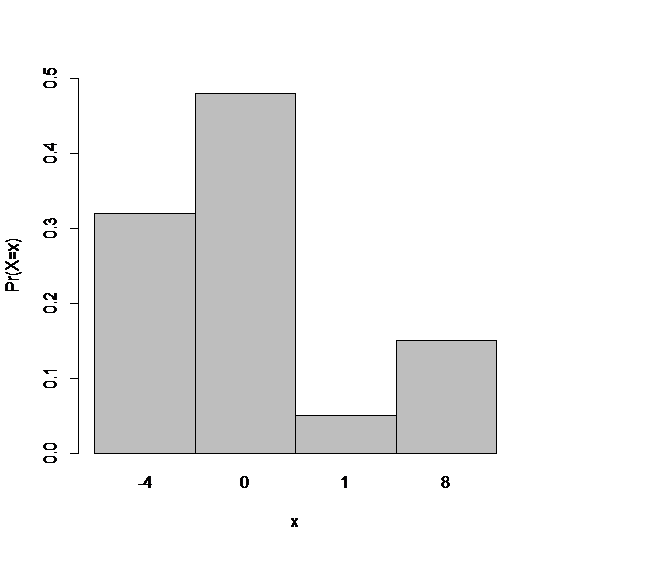
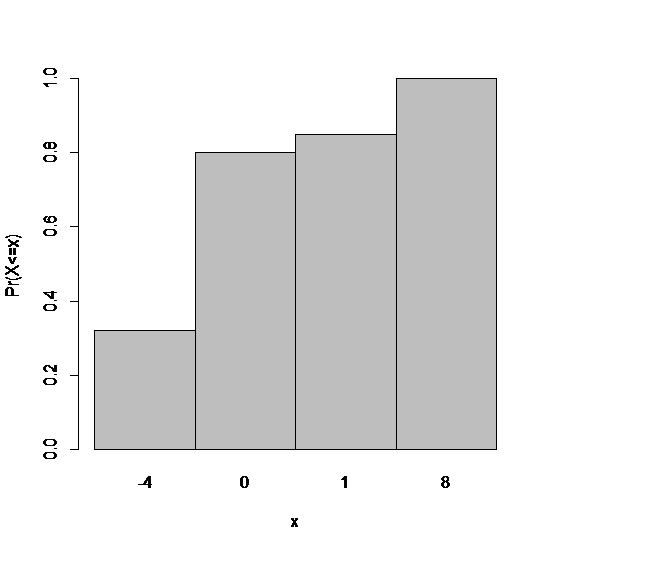
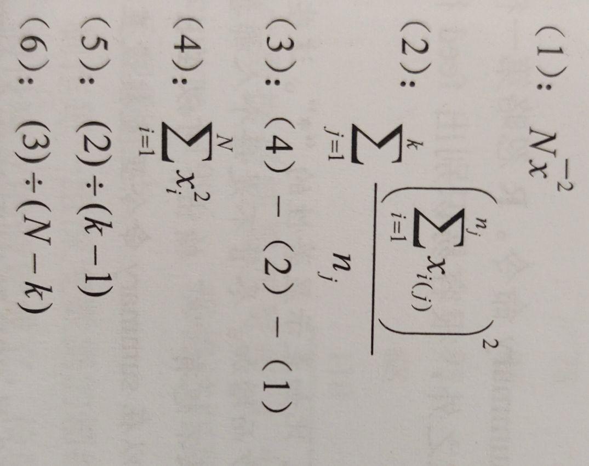
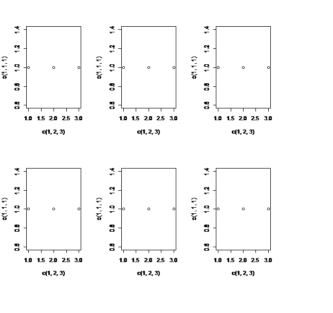
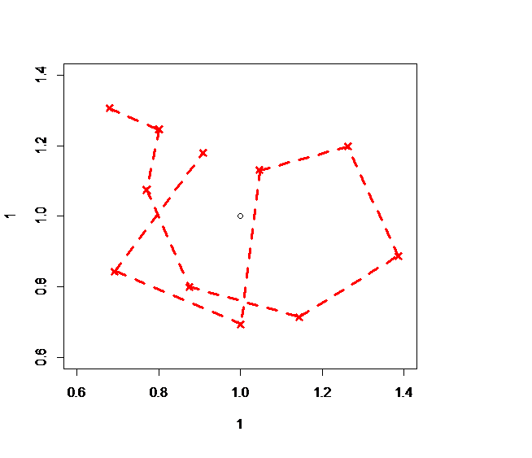
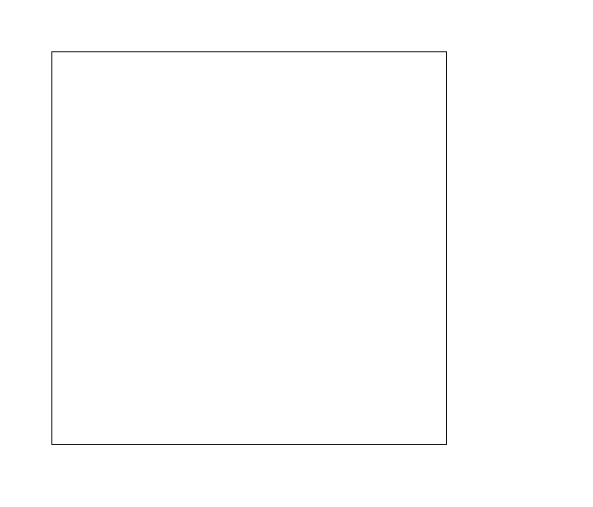
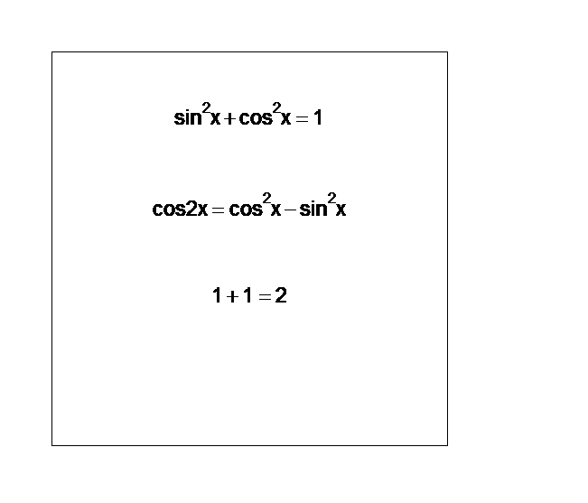

#  R语言

始记于2023.07.04 凌晨 01 : 15         寝室

终记于2023.07.11 下午 17 : 43         图书馆

大概用了7天时间，约30小时学习并整理记录；

因个人精力有限，统计检验与建模部分大多为已学习知识，高级绘图部分多为大量函数堆砌，这两部分草草总结；

该笔记旨在串联R语言相关知识，细节难免有所缺失，仅供参考；

笔记中出现的所有函数代码 大多数来自 《R语言之书：编程于统计》[Tilman M.Davies 著][李毅 译]

-------warm_stones

## 一、基础语言

### 1.入门

#### 调试

##### 注释：

```R
#这是一段注释
```

##### 查看最近执行的代码

⬆和⬇


#### 工作路径

##### 查看工作路径：

```R
getwd()
```

##### 改变默认工作路径：

```R
setwd()
```


#### R包

##### 下载安装“包”：

```R
install.packages("包名")
```

##### 更新“包”：

```R
update.packages()
```

##### 加载已安装包：

```R
library()
```


#### 编码分隔

##### **逗号分隔**：

```R
> X<-c(c(1,2,3,4),
+ c(1.1,9.9,0),
+ c(777,666.001,333))

> X
 [1]   1.000   2.000   3.000   4.000   1.100   9.900   0.000 777.000 666.001
[10] 333.000

```


#### 查看已有对象

```R
ls()
```


#### cat()

注：我发现要整个函数全部运行完毕，控制台上才会显示cat( )输出...

在R语言中，`cat()`函数用于输出一个或多个对象的内容到控制台或文件。它将对象转换为字符形式，并按照指定的方式打印出来。

```R
> cat(..., sep = " ", file = "", append = FALSE)
# ...：一个或多个要输出的对象。
# sep：用于分隔每个对象的字符串，默认为一个空格。
# file：要将输出写入的文件名，如果为空字符串（默认值），则输出到控制台。
# append：是否以追加模式写入文件，如果为TRUE，则在已有内容之后添加新内容。
```


### 2.数值  向量

#### 运算

```R
# ^ 指数幂
# sqrt() 平方根
# log()  对数   log(x,y) 以y为底，x为真数
# exp()  指数
```


#### 向量

##### 创建向量

```R
> myvec <- c(2,5,9,6,5,9)
> myvec
[1] 2 5 9 6 5 9
```


###### 序列 seq

```R
> #直接得到
> #会从from已知以固定步长 by = 1(-1)遍历到to
> 3:20
 [1]  3  4  5  6  7  8  9 10 11 12 13 14 15 16 17 18
[17] 19 20
> foo <- -5.3
> bar <- foo:(-47+2.1)
> bar
 [1]  -5.3  -6.3  -7.3  -8.3  -9.3 -10.3 -11.3 -12.3
 [9] -13.3 -14.3 -15.3 -16.3 -17.3 -18.3 -19.3 -20.3
[17] -21.3 -22.3 -23.3 -24.3 -25.3 -26.3 -27.3 -28.3
[25] -29.3 -30.3 -31.3 -32.3 -33.3 -34.3 -35.3 -36.3
[33] -37.3 -38.3 -39.3 -40.3 -41.3 -42.3 -43.3 -44.3

> #序列函数得到
> seq(from=3,to=27,by=3)  # by--步长
[1]  3  6  9 12 15 18 21 24 27
> seq(from=3,to=27,length.out=40) # length.out--序列中元素个数
 [1]  3.000000  3.615385  4.230769  4.846154
 [5]  5.461538  6.076923  6.692308  7.307692
 [9]  7.923077  8.538462  9.153846  9.769231
[13] 10.384615 11.000000 11.615385 12.230769
[17] 12.846154 13.461538 14.076923 14.692308
[21] 15.307692 15.923077 16.538462 17.153846
[25] 17.769231 18.384615 19.000000 19.615385
[29] 20.230769 20.846154 21.461538 22.076923
[33] 22.692308 23.307692 23.923077 24.538462
[37] 25.153846 25.769231 26.384615 27.000000

```


###### 重复函数rep

```R
> rep(x=1,times=4)
[1] 1 1 1 1
> rep(x=c(1,2,3),times=2)  times--整体复制
[1] 1 2 3 1 2 3
> rep(x=c(1,2,3),each=2)   each--原地复制
[1] 1 1 2 2 3 3
```


###### 排序函数sort

```R
> sort(x=c(...),decreasing=F)
> #decreasing -- T：降序 , F：升序
```


###### 长度函数length

```R
> length(x=c(1,2,3,4))
[1] 4
> length(c(1,2,3,4))
[1] 4
```


##### 向量运算

###### [     ]

提取向量子集

```R
> myvec<-c(1,2,3,4,5,6,7)
> myvec
[1] 1 2 3 4 5 6 7
> myvec[-1] #仅仅返回值，不会改变工作空间中的原始向量
[1] 2 3 4 5 6 7
> myvec[-2:-1] 
[1] 3 4 5 6 7
> myvec[1:2]
[1] 1 2
```


###### sum()

所有向量元素和


###### prod()

所有向量元素相乘


### 3.矩阵和数组

#### 定义矩阵

##### 填充方式

```R
> matrix(data=c(1,2,3,4,5,6),nrow=2,ncol=3)
     [,1] [,2] [,3]
[1,]    1    3    5
[2,]    2    4    6
> #默认逐列填充矩阵 关键字byrow=FALSE
> #否则：逐行填充矩阵
> matrix(data=c(1,2,3,4,5,6),nrow=2,ncol=3,byrow=TRUE)
     [,1] [,2] [,3]
[1,]    1    2    3
[2,]    4    5    6
```


##### 合并行和列

```R
#行合并
> rbind(c(1,3,5),c(2,4,6))
     [,1] [,2] [,3]
[1,]    1    3    5
[2,]    2    4    6

#列合并
> cbind(c(1,3,5),c(2,4,6))
     [,1] [,2]
[1,]    1    2
[2,]    3    4
[3,]    5    6
```


##### 矩阵维度

```R
> mymat<-matrix(data=c(1,2,3,4,5,6),nrow=2,ncol=3)
> mymat
     [,1] [,2] [,3]
[1,]    1    3    5
[2,]    2    4    6
> dim(mymat)  #维度
[1] 2 3
> nrow(mymat) #行维
[1] 2
> ncol(mymat) #列维
[1] 3
```


#### 构造子集

##### 按行、列提取元素

```R
> mymat[1,2] #提取第一行第二列元素

> mymat[,2]  #提取第二列元素
> mymat[1,]  #提取第一行元素

> mymat[2:1,3]#依次提取第二行、第一行的第三列元素

> mymat[c(1,3),2]#依次提取第一行，第三行的第二列元素
```


##### 按对角线提取元素

```R
> diag(x=mymat)
```


#### 矩阵运算

##### 转置函数

```R
> t(mymat)
```

##### 逆矩阵

```R
> solve(mymat)
```

##### 单位矩阵

```R
> newmymat <- diag(x=n) #n阶单位矩阵
```


##### 运算

**矩阵数乘**

```R
> mymat*2 #所有元素乘2
```

**矩阵加减**

```R
# 同阶矩阵 各个元素依次计算
> mymat1 - mymat2
> mymat1 + mymat2
```

**矩阵乘法**

```R
#运算符: %*%
#运算要求符合矩阵乘法规律
> A%*%B
```


#### 多维数组

##### 定义

```R
> AR<-array(data=1:24,dim=c(2,2,3,2))
> AR
, , 1, 1

     [,1] [,2]
[1,]    1    3
[2,]    2    4

, , 2, 1

     [,1] [,2]
[1,]    5    7
[2,]    6    8

, , 3, 1

     [,1] [,2]
[1,]    9   11
[2,]   10   12

, , 1, 2

     [,1] [,2]
[1,]   13   15
[2,]   14   16

, , 2, 2

     [,1] [,2]
[1,]   17   19
[2,]   18   20

, , 3, 2

     [,1] [,2]
[1,]   21   23
[2,]   22   24

```

##### 子集

```R
> AR[2,,,2]
     [,1] [,2] [,3]
[1,]   14   18   22
[2,]   16   20   24
```


### 4.非数值型数据

#### 逻辑值

##### 基础

**FALSE**   <=>    **F**

**TRUE**    <=>    **T**

```R
#逻辑值也是数值
> T+T+F+T+F+F+F
[1] 3
> T+T-F+T-F-T
[1] 2
> T+T
[1] 2
#单个逻辑值就会正常呈现
> T
[1] TRUE
```

##### 利用逻辑值提取子集

```R
> myvec
[1] 1 2 3 4 5 6 7

> myvec[myvec>3]
[1] 4 5 6 7

#相当于
> temp<-myvec>3 #得到逻辑值集合
> temp
[1] FALSE FALSE FALSE  TRUE  TRUE  TRUE  TRUE
> myvec[temp]
[1] 4 5 6 7
```

##### 搜寻

```R
> which(x=...,arr.ind=...)
> #arr.ind为T:返回特定维数的指标
```


#### 字符

##### 创建

```R
> char<-"There is nothing difficult !"
```

##### 长度

```R
> nchar(char)
[1] 28
```

##### 连接

```R
> a<-"There is"
> b<-"nothing"
> c<-"difficult !"
# 
> paste(a,b,c)
[1] "There is nothing difficult !"
> paste(a,b,c,sep="")#sep--间隔符
[1] "There isnothingdifficult !"
# 
> cat(a,b,c)
There is nothing difficult !
```

##### 子集与匹配

```R
> char<-"There is nothing difficult !"
# substr提取字符串子集
> substr(x=char,start=1,stop=5)
[1] "There"
> substr(x=char,start=1,stop=5)="Hahah"
> char
[1] "Hahah is nothing difficult !"

# pattern--被匹配字符串模式   replacement--用作替换的字符串
# sub匹配第一个字符串并替换
> sub(pattern="is",replacement="Heihei",x=char)
[1] "Hahah Heihei nothing difficult !"

# gsub匹配每一个字符串并替换
> gsub(pattern="is",replacement="Heihei",x=char)
[1] "Hahah Heihei nothing difficult !"
```


### 5.列表和数据框

#### 列表对象

##### 创建列表

```R
> foo<-list(matrix(data=1:4,nrow=2,ncol=2),c(T,T,F,T),"hello")
> foo
[[1]]
     [,1] [,2]
[1,]    1    3
[2,]    2    4

[[2]]
[1]  TRUE  TRUE FALSE  TRUE

[[3]]
[1] "hello"

#长度
> length(foo)
[1] 3
```

##### 访问组件

```R
# 双中括号
> foo[[1]]
     [,1] [,2]
[1,]    1    3
[2,]    2    4
> foo[[1]][1,2]
[1] 3

> foo[[c(1,2)]]
[1] 2

# 单中括号
> foo[c(1,2)]
[[1]]
     [,1] [,2]
[1,]    1    3
[2,]    2    4

[[2]]
[1]  TRUE  TRUE FALSE  TRUE
```


##### 命名

**$**

**names( x )=c("..." , "..." , ... )**

**创建列表时在list函数内指定名字，或者使用名字和美元符号来提取组件    不需要放置在双引号内   即意味着名字并不是字符串类型**


##### 嵌套

略


#### 数据框

##### 创建数据库

```R
> mydata<-data.frame(person=c("A","B","C"),age=c(18,20,19),sex=factor(c("M","F","F")))
> mydata
  person age sex
1      A  18   M
2      B  20   F
3      C  19   F
```

##### 提取数据框的行/列

**[    ]**

```R
> mydata[1,2]
[1] 18
```


### 6.特殊值、类型和转换

#### 特殊值

##### 无穷数

```R
> num<-Inf

> Inf+1
[1] Inf
> Inf*-1
[1] -Inf
> Inf/100
[1] Inf
> 1/0
[1] Inf
```


##### NaN

**非数值**

```R
> Inf*0
[1] NaN
> -Inf+Inf
[1] NaN
> Inf/Inf
[1] NaN
> NaN+1
[1] NaN
```

```R
> is.nan(temp)
```


##### NA

**缺失值**

```R
> is.na(temp)
```


##### NULL

**空值**

```R
> R<-c(NULL,NULL,NULL)
> R
NULL
```

```R
> is.null(temp)
```


#### 类型

##### 属性

```R
> mymat<-matrix(data=1:9,nrow=3,ncol=3)
> mymat
     [,1] [,2] [,3]
[1,]    1    4    7
[2,]    2    5    8
[3,]    3    6    9
#利用attributes函数输出显性属性
> attributes(mymat)
$dim
[1] 3 3
#已知属性的名字，可以使用attr
> attr(x=mymat,which="dim")
[1] 3 3
> dim(mymat)
[1] 3 3
```

##### 对象类别

```R
#########
#class()#
#########
> num.vec1<-1:4
> num.vec2<-seq(from=1,to=4,length=6)
> char.vec<-c("a","is not","b")
> logic.vec<-c(T,T,F,T)
> fac.vec<-factor(c("Blue","Green","Yellow"))

> num.vec1
[1] 1 2 3 4
> class(num.vec1)
[1] "integer"

> num.vec2
[1] 1.0 1.6 2.2 2.8 3.4 4.0
> class(num.vec2)
[1] "numeric"

> char.vec
[1] "a"      "is not" "b"   
> class(char.vec)
[1] "character"

> logic.vec
[1]  TRUE  TRUE FALSE  TRUE
> class(logic.vec)
[1] "logical"

> fac.vec
[1] Blue   Green  Yellow
Levels: Blue Green Yellow
> class(fac.vec)
[1] "factor"

################################
#也会有多个类型的情况，返回多个字符串#
################################
```


#### 函数

##### 检查对象函数is.

##### 转换函数as.

```R
> as.factor()      #因子类型
> as.character()   #字符串
> as.vector()      #向量
> as.numeric()     #数字
> as.matrix()
> as.data.framea()
```


### 7.基本绘图

#### plot及参数

```R
> plot( x, y, type="", main="", xlab="", ylab="", col="")

# 参数详解
#############################
> type #设置图形类型
#############################
# 值为字符串
> main #设置标题
  > xlab #设置x轴标签
> ylab #设置y轴标签
#############################
> col #设置点或线的颜色
#############################
# 值为整数
> pch #设置数据点的特征
> lty #设置线的类型
> cex #设置点的大小倍数
> lwd #设置线的粗细倍数
#############################
> xlim #设置画图区域限制
> ylim #需要长度为2的数值向量
#############################
> 
#############################
> 
#############################
```


### 8.读写文件

#### 读入文件

```R
##########################################
# file=""             文件名和文件位置     # 
# header=TRUE         R是否有表头的逻辑值  #
# sep=" "             分隔符字符串        #
# na.string="*"       缺失值用该字符串替代 #
# stringAsFactor=TRUE 希望变量处理为因子   #
# #######################################
# 1.txt文件  2.基于网页的文件
> read.table(file=  ,header=  ,sep=  ,na.string=  ,... ...)

# csv文件
> read.csv()
```

```R
#通过file.choose()命令直接打开文件系统浏览器
> file.choose()
#打印具体文件夹目录
> list.files()
#关闭文件图形设置
> dev.off()
```


#### 写出数据文件图像

```R
# 数据写入文件
> write.table()
> write.csv()

# zi'fu'l
# 把R对象写到文件(ASCII)
> dput()
# 导入(ASCII)对象文件
> dget()
```


## 二、编程

### 1.调用函数

#### 作用域

##### 环境

**1.全局环境**

**2.包环境和命名空间**

**3.本地环境**


##### 保留字

```R
# 不能用作变量名......
if , else
for , while , in
function
repeat , break , next
TRUE , FALSE
Inf , -Inf
NA , NaN , NULL
```


#### 参数匹配

```R
# args()显示函数的参数
# ...省略了可选参数
> args(plot)
function (x, y, ...)
NULL
# ...表示允许用户提供任意数量的数据向量
> args(data.frame)
function (..., row.names = NULL, check.rows = FALSE, check.names = TRUE, 
    fix.empty.names = TRUE, stringsAsFactors = FALSE) 
NULL
```

**局部匹配**

```R
# 在matrix()中
# nr --> nrow
# di --> dimnames
# 缩写了参数标签，这要求:1.参数标签必须唯一确定 2.没有其它匹配缩写
```


### 2.条件和循环

#### 条件判断

##### if else语句

```R
# 一条if语句仅能检查一个逻辑值条件
> if(condition){
    #执行语句1
}
#从左括号{开始，直到}结束时，括号内代码才开始执行

#遇到逻辑值集时，使用函数帮助
> all()
> any()

> if(condition){
    #执行语句2
}else{
    #执行语句3
    #可以嵌套
}
```

##### ifelse

```R
# 可以在相对简单的情况下执行向量性检验
> ifelse(test= ,yes= ,no= )
# 根据test条件进行检验，符合的用参数yes值代替，不符合的用no
```

##### switch

相当于  ：多重if判断语句


#### 循环代码

##### for

```R
# 类似于python
> for(element in object){
    #循环内容
}

> for(num in 1:10){
+ cat(num,"\n")
+ }
1 
2 
3 
4 
5 
6 
7 
8 
9 
10 
```


##### while

```R
> while(condition){
    do something repeatedly...
}
```


##### 关键词控制

**next** **break**

```R
next   <--> continue
break
```

**repeat**

```R
# 重复代码直到break
> repeat{
    keep doing something...
    #必须要声明break边界
}
```


##### 隐式循环apply

```R
> apply(X=  ,MARGIN=  ,FUN=  )
# MARGIN表示对X的某个边际(行、列、层、块...)进行操作  分别用值1,2,3,4...表示
# FUN表示对边际执行的函数
```


##### 其它apply函数 (略)


### 3.编写函数

#### 函数命令

```R
> functionName <- function(arg1,arg2,...){#function关键字   
                                         #argi形参(i=1,2,3,...)
                                         #可以不传入参数
    do something...
    
    return()   #只能返回单值  
               #可以没有返回值
               #结束整个函数
}
```


#### 参数

##### 检查缺失参数

```R
> missing(/参数标签/)
# missing函数用于检查在函数中是否提供了指定的参数的值
# 找得到指定参数则返回TRUE 否则返回FALSE
```

##### 省略号

```R
#允许提供额外参数，且无需在参数列表中明确定义，然后将参数传递到另一函数代码中
> myfibplot<-function(thresh,plotit=TRUE,...){
    fibseq<-c(1,1)
    if(plotit){
        plot(1:length(fibseq),fibseq,...)
    }else{
        return(fibseq)
    }
}
```


#### 特殊函数

##### 一次性函数

```R
> mymat
     [,1] [,2] [,3]
[1,]    1    4    7
[2,]    2    5    8
[3,]    3    6    9

> apply(mymat,MARGIN=2,FUN=function(x){sort(rep(x,2))})#function(){}定义一次性函数
     [,1] [,2] [,3]
[1,]    1    4    7
[2,]    1    4    7
[3,]    2    5    8
[4,]    2    5    8
[5,]    3    6    9
[6,]    3    6    9

```


### 4.异常值、计时和可见性

#### 异常处理

##### 错误与警告

```R
# 错误
> stop(字符串,整数,...都可以)
错误: 字符串整数...都可以

# 警告
> warning("askdshdskfaj","111")
Warning message:
askdshdskfaj111
```

##### 捕获错误

```R
> attemp<-try(myown(0))
Error in myown(0) : 没有"myown"这个函数

# silent=TRUE 抑制了错误信息传到控制台
> attemp<-try(myown(0),silent=TRUE)
> attemp<-try(myown(0),silent=FALSE)
Error in myown(0) : 没有"myown"这个函数

# 错误信息会存储在变量中
> attemp
[1] "Error in myown(0) : 没有\"myown\"这个函数\n"
attr(,"class")
[1] "try-error"
attr(,"condition")
<simpleError in myown(0): 没有"myown"这个函数>
```


#### 进度与计时

##### Sys.sleep暂停

```R
> Sys.sleep(3) #暂停3秒
```

##### Sys.time计时

```R
> t1<-Sys.time()
> myownfunction(1,2)
> t2<-Sys.time()
> t2-t1
Time difference of 29.46598 secs
```


#### 隐藏

寻找对象时，R将使用前面的对象或函数，后续的同名会被隐藏，我们需要额外的代码来访问另一个被隐藏的对象

```R
#通过search()来查看当前搜索路径
> search()
#根据当前搜索路径中的库/对象名，删除
> detach("package:car",unload=TRUE)#移除包car
#根据库/对象名添加导当前搜索路径
> attach(foo)#添加对象foo
```


## 三、统计学与概率

### 1.初级统计学

#### 统计概要

##### 均值、中位数、众数

*na.rm=TRUE 可以强制令函数只作用于数据集中的数值型数据*

```R
> xdata <- c(1,2,99,3,2,2,3,3,0,0,99)
> xdata
 [1]  1  2 99  3  2  2  3  3  0  0 99
# 均值
> mean(xdata,na.rm=TRUE) #na.rm可以强制令函数只作用于数据集中的数值型数据
[1] 19.45455

# 中位数
> median(xdata)
[1] 2

# 众数
> table(xdata) #汇总频数
> xtab <- table(xdata) #xtab储存频数情况
> xtab
xdata
 0  1  2  3 99 
 2  1  3  3  2 
> xtab[xtab==max(xtab)] #找到最大频数及其对应值
xdata
2 3      # 值  频数
3 3 
```


##### 方差、标准差

```R
> var() #方差
> sd()  #标准差
```


##### 估读

```R
> round( goaldata , digits= num ) #digits表示小数点后保留几位
```


#### 分位数/百分位数

```R
# quantile()将数字向量设为第一个参数，赋给prob，得到相应的分位数
> quantile(xdata,prob=c(0.1,0.23,0.5,0.77))
10% 23% 50% 77% 
0.0 1.3 2.0 3.0 
```

##### 分位差

```R
> IQR()
```


#### 协方差/相关系数

```R
> cov(bar1,bar2)
# cor(bar1,bar2) == cov(bar1,bar2)/(sd(bar1)*sd(bar2))
# 相关系数=协方差/标准差之积
> cor(bar1,bar2)
```


### 2.数据可视化基础

略


### 3.概率

#### 离散型随机变量

```R
> X.outcomes <- c(-4,0,1,8)
> X.prob <- c(0.32,0.48,0.05,0.15)
> barplot(X.prob,ylim=c(0,0.5),names.arg=X.outcomes,space=0,
+ xlab="x",ylab="Pr(X=x)")
# space=0消除条形之间的间隙
```



```R
# 利用cumsum函数对X.prob中的条目逐步累积求和
# (即(x1,x2,x3,...)--->(x1,x1+x2,x1+x2+x3,...))
> X.cumul <- cumsum(X.prob)
> X.cumul
[1] 0.32 0.80 0.85 1.00
> barplot(X.cumul,names.arg=X.outcomes,space=0,xlab="x",ylab="Pr(X<=x)")
```



#### 连续型随机变量


### 4.常见的概率分布

#### 常见的概率质量函数

##### 泊松分布

###### dpois

泊松质量函数

```R
# 计算泊松分布的概率密度函数
# 计算随机变量等于x的概率
> dpois(x, lambda)
```


###### ppois

**泊松累积问题**

```R
# 计算累积分布函数
# 计算随机变量小于等于x的概率
> ppois(x, lambda)
```


###### qpois

**泊松分位点函数**

```R
# 计算分位点函数
# 给定概率p，找到对应的随机变量取值
> qpois(p, lambda)
```


###### rpois

**泊松随机实现**

```R
# 生成随机变量
# 生成n个服从泊松分布的随机变量
> rpois(n, lambda)
```


##### 二项分布

###### dbinom

**二项式质量函数**

```R
# 计算二项分布的概率质量函数值
> dbinom(k, size = n, prob = p)
# x    目标情况出现频次
# size 试验总数
# prob 每次试验成功概率
# P(X = x) = C(size, x) * prob^x * (1-prob)^(size-x)
```


###### pbinom

**二项累计问题**

```R
# 计算二项分布的累积分布函数值
> pbinom(k, size = n, prob = p)
```


###### qbinom

二项分位数函数

```R
# 计算二项分布的分位点（反函数值）
> qbinom(p, size = n, prob = p)
```


###### rbinom

二项式随机实现

```R
# 生成二项分布的随机样本
> rbinom(n, size = n, prob = p)
```


#### 常见的概率密度函数

##### 均匀分布

###### dunif

**均匀密度函数**

```R
# 计算均匀分布的概率密度函数
# min 和 max 分别表示均匀分布的定义域的下界a和上界b
# x表示要计算概率密度函数的随机变量取值
dunif(x, min = a, max = b)
```


###### punif

**均匀累积问题**

```R
# 计算均匀分布的累积分布函数
# q表示要计算累积分布函数的随机变量取值
punif(q, min = a, max = b)
```


###### qunif

**均匀分位数**

```R
# 计算均匀分布的分位点（反函数值）
# p表示给定概率的分位点
qunif(p, min = a, max = b)
```


###### runif

**均匀随机实现**

```R
# 生成均匀分布的随机样本
# n表示要生成的随机样本数量
runif(n, min = a, max = b)
```


##### 正态分布

###### dnorm

**正态密度函数**

```R
# 计算正态分布的概率密度函数
# x 表示要计算概率密度函数的随机变量取值
# mean 和 sd 分别表示正态分布的均值和标准差。
dnorm(x, mean = μ, sd = σ)
```


###### pnorm

**正态累积问题**

```R
# 计算正态分布的累积分布函数
# q 表示要计算累积分布函数的随机变量取值
pnorm(q, mean = μ, sd = σ)
```


###### qnorm

**正态分位数**

```R
# 计算正态分布的分位点（反函数值）
# p 表示给定概率的分位点
qnorm(p, mean = μ, sd = σ)
```


###### rnorm

**正态随机实现**

```R
# 生成符合正态分布的随机样本
# n 表示要生成的随机样本数量
rnorm(n, mean = μ, sd = σ)
```


##### t分布

```R
# 计算t分布的概率密度函数
dt(x, df)
# 计算t分布的累积分布函数
pt(q, df)
# 计算t分布的分位点（反函数值）
qt(p, df)
# 生成t分布的随机样本
rt(n, df)

# x 表示要计算概率密度函数的随机变量取值
# q 表示要计算累积分布函数的随机变量取值
# p 表示给定概率的分位点
# n 表示要生成的随机样本数量
# df 表示t分布的自由度。
```


##### 指数分布

```R
# 计算指数分布的概率密度函数
dexp(x, rate = λ)

# 计算指数分布的累积分布函数
pexp(q, rate = λ)

# 计算指数分布的分位点（反函数值）
qexp(p, rate = λ)

# 生成符合指数分布的随机样本
rexp(n, rate = λ)
```


## 四、统计检验与建模

### 1.抽样分布和置信度


### 2.假设检验

#### df --- 自由度

自由度（degrees of freedom，简写为 df）是统计学中的一个概念，用于描述样本数据中可以自由变动的独立信息的数量。

在不同的统计分析中，自由度的含义可能会有所差异。以下是几个常见情况下自由度的解释：

1. t 分布中的自由度：在 t 分布中，自由度表示用于估计总体方差的样本数据点的数量。对于一组包含 n 个观测值的样本，t 分布的自由度为 n-1。

2. 卡方分布中的自由度：在卡方分布中，自由度表示用于计算卡方统计量的独立观测值的数量。对于一个 c 表格（crosstab），其中有 r 行和 k 列，卡方分布的自由度为 (r-1) * (k-1)。

3. F 分布中的自由度：在 F 分布中，自由度表示用于计算 F 统计量的两组独立样本的自由度。F 分布的自由度分别为第一组样本的自由度和第二组样本的自由度。

需要注意的是，自由度通常是针对特定的统计分布或检验而言的，并不是针对整个数据集的。


#### 均值检验

##### t检验 t.test()

```R
> t.test(x=  [,y=  ],alternative=  [,mu=  ,conf.level=  ,var.equal=  ])
# x=... ,y=...  ---> 双样本 t检验  需要设定 var.equal=TRUE
# x=...         ---> Welch t检验  var.equal为默认值FALSE

# 备择假设alternative参数:"less"     代表<  
#                       "greater"  代表> 
#                       "two.sided"代表≠（不等于）

# 置信度1-α默认值为0.05,利用conf.level参数可修改
# 例如 conf.level=0.9  -->  1-α=0.9


```


#### 比例检验

##### Z检验 prop.test()

```R
# 该函数实际上以略微不同的方式使用卡方分布执行检验
# 使用prob.test()函数得到的p值与Zbased检验结果相同   二者等效

# 单个比例
> prop.test(x=sum(  ),n=length(  ),p=  ,
            correct=FALSE,alternative="two.sided",conf.level=0.95 )
# 成功次数x  试验总数n  零值p
# alternative="two.sided" ,conf.level=0.95 为默认值 同t.test()

# 两个比例
> prop.test(x=c(x2,x1),n=c(n2,n1),correct=FALSE)
```


#### 分类变量检验

##### 卡方分布/独立性检验chisq.test()

```R
# chisq.test()函数：执行卡方GOF检验;     将观测频率的向量作为第一个参数x     当不进行均匀性GOF检验时,类别之间真实速率需要通过 提供零值比例作为与x等长的向量赋值给p
> chisq.test(x=  [,p=c(  ,  , ...)])
# 得到X-squared ,df ,p-value
```


#### 错误与功效

##### 假设检验错误

$$
进行假设检验的目的是获得p值，通过该量化的数据来反对原假设H_0
\\
如果p值本身小于预定义的显著性水平α，那就不能支持备择假设H_A
$$

$$
举个例子\\H_0:μ=μ_0 \\\ H_1:μ>μ_0
$$

##### 第I类错误

$$
当H_0为真时，拒绝H_0
$$

##### 第II类错误

$$
当H_0为假时，保留H_0 (即没有保留真实的H_A)
$$

##### 统计功效

略


### 3.方差分析

|              | df(自由度) | SS(平方和) | MS(均方) | F(F检验统计量) | p(p值) |
| ------------ | ---------- | ---------- | -------- | -------------- | ------ |
| 总体         | 1          | (1)        |          |                |        |
| 组(或因素)   | k-1        | (2)        | (5)      | (5)➗(6)        | p值    |
| 误差(或残差) | N-k        | (3)        | (5)      |                |        |
| 合计         | N          | (4)        |          |                |        |



#### 单因素方差分析

##### aov函数

```R
> chick.anova <- aov(YYY~XXX,data=...)
# 根据数据集...，检验 XXX对于YYY的影响 ,二者为数据集中的变量
> summary(chick.anova) # 通过summary输出结果
```

#### 双因素方差分析


#### Kruskal-Wallis检验

##### kurskal.test()

```R
> kruskal.test(Age~smoke,data=survey)
# 根据数据集survey，检验 smoke对于Age的影响 
# 得到相应参数
```


### 4.简单线性回归


### 5.多元线性回归


### 6.线性模型选择和诊断


## 五、高级绘图

### 1.自定义高级绘图

#### 图形设备

##### 设备开关

```R
> plot(c(1,2,3),c(1,1,1))
# plot会打开一个新设备并在其上绘制
# 主设备值为1，此后打开的设备依次为2，3，4，...

# 打开新设备，并自动切换到该新设备
# 可以通过width,height参数设置设备长宽
> dev.new()

# 关闭指定设备
> dev.off(2)

# 切换设备
# 若不切换设备，则绘图会不断在当前设备进行
> dev.set(2)
```


##### 设备中多图

```R
# 设置 mfrow参数
# par()函数用于设置图形参数以影响绘图的外观和布局
> par(mfrow=c(2,3)) # 二行三列 共2x3=6个子图
> plot(c(1,2,3),c(1,1,1))
> plot(c(1,2,3),c(1,1,1))
> plot(c(1,2,3),c(1,1,1))
> plot(c(1,2,3),c(1,1,1))
> plot(c(1,2,3),c(1,1,1))
> plot(c(1,2,3),c(1,1,1))
```



#### 区域和边界

##### 默认间距

```R
# 图形参数oma(外边界)
> par()$oma
[1] 0 0 0 0
# 图形参数mar(图边界)
> par()$mar
[1] 5.1 4.1 4.1 2.1
```

##### 自定义间距

```R
# oma=c(1,4,3,2)使底部、左侧、顶部和右侧区域分别是1行、4行、3行和2行
# mar=4:7使图形边距分别是4,5,6,7
> par(oma=c(1,4,3,2),mar=4:7)
> plot(1:10)
> box("figure",lty=2)
> box("outer",lty=3)
```

##### 剪切

**xpd参数**

```R
> arrows(...,xpd=TRUE)
> text(...,xpd=TRUE)
```


#### 点击式坐标互动

##### 获取坐标

```R
> plot(1,1)
> locator() #调用这个函数后，可以在当前图形设备中用左键确认点
            #确认点后，可以选择用滚轮键结束选取，并输出这些点坐标
#这里我随意选择了两个点
$x
[1] 0.8525864 1.2066191

$y
[1] 1.218453 1.125888


#若在dev.new()获取的空图形设备上则无法进行
> dev.new()
> locator()
Error in locator() : plot.new has not been called yet
```

##### 可视化坐标

```R
> plot(1,1)
> Rtist<-locator(type="o",pch=4,lty=2,lwd=3,col="red",xpd=TRUE)
#type="o"会产生过度绘制的点和线
#typr="p"绘制点
#typr="l"绘制行
```



```R
> Rtist
$x
 [1] 0.6805704 0.8005815 0.7705788 0.8745884 1.1446134 1.3866358 1.2626243
 [8] 1.0466043 1.0006001 0.6925715 0.9085915

$y
 [1] 1.3063895 1.2462224 1.0749775 0.7995972 0.7139747 0.8875337 1.1976259
 [8] 1.1305164 0.6931476 0.8435655 1.1791129
```


##### 专用注释

```R
# 略
```


#### 自定义传统R图形

##### 样式和禁止的图形参数

```R
> 
> 
```

##### 自定义边框

```R
>
>
```

##### 自定义坐标轴

```R
>
>
```


#### 专用文本与标签符号

##### 字体

```R
# family ---  "sans"(默认)   "serif"   "mono"          <-三大通用族
# font   ---    1(默认)  2：粗体  3：斜体  4：粗体和斜体   <-四大通用体

> mtext("fonts",line=1,at=0.5,cex=2,family="mono",font=4)
```

##### 希腊符号

```R
# expression()函数用于创建一个表达式对象。这些表达式对象可以用于绘图、标签、注释等方面。

# α（alpha）：表示角度、系数、阈值等。
> expression(alpha)
# σ（sigma）：表示标准差、总和等。
> expression(sigma)
# β（beta）：在统计学中，表示回归系数、风险因子等。
> expression(beta)
# γ（gamma）：在数学和物理学中，表示伽玛函数、光的折射指数等。
> expression(gamma)
# Γ（Gamma大写）：表示伽玛分布、伽马射线等。
> expression(Gamma) 
# φ（phi）：表示黄金比例、概率分布函数等。
> expression(phi)
# τ（tau）：表示时间常数、周转率等。
> expression(tau)
```

##### 数学表达式

```R
# 创建绘图白板
> par(mar=c(3,3,3,3))
> plot(1,1,type="n",xlim=c(-1,1),ylim=c(0.5,4.5),xaxt="n",yaxt="n",ann=FALSE)
```



```R
> expr1 <- expression(paste(sin^2,x+cos^2,x==1))
#利用paste()可以将那些没有函数运算符号连接的组块连接起来
> expr2 <- expression(paste(cos2x==cos^2,x-sin^2,x))
> expr3 <- expression(1+1=2)
# 在白板上绘制数学表达式
> text(0,4:2,labels=c(expr1,expr2,expr3),cex=1.5)
```




### 2.图形深入

#### 平滑和阴影

```R
> 
> 
```

#### 多图形和变量的分面

```R
> 
> 
```

#### ggvis包：交互

```R
# 首先创建声明surv数据框，加载ggvis
> library("MASS")
Warning message:
程辑包‘MASS’是用R版本4.3.1 来建造的 
> library("ggvis")
Warning message:
程辑包‘ggvis’是用R版本4.3.1 来建造的 
> surv <-na.omit(survey[,c("Sex","Wr.Hnd","Height","Smoke","Exer")])
> surv
       Sex Wr.Hnd Height Smoke Exer
1   Female   18.5 173.00 Never Some
2     Male   19.5 177.80 Regul None
4     Male   18.8 160.00 Never None
5     Male   20.0 165.00 Never Some
6   Female   18.0 172.72 Never Some
7     Male   17.7 182.88 Never Freq
8   Female   17.0 157.00 Never Freq
9     Male   20.0 175.00 Never Some
10    Male   18.5 167.00 Never Some
11  Female   17.0 156.20 Never Freq
13  Female   16.0 155.00 Never Some
14  Female   19.5 155.00 Never Some
16  Female   17.5 156.00 Never Freq
17  Female   18.0 157.00 Never Freq
18    Male   19.4 182.88 Never Some
19    Male   20.5 190.50 Never Some
20    Male   21.0 177.00 Never Freq
21    Male   21.5 190.50 Never Freq
22    Male   20.1 180.34 Never Freq
23    Male   18.5 180.34 Never Freq
24    Male   21.5 184.00 Never Some
27    Male   21.0 172.72 Never Some
28    Male   20.8 175.26 Never Freq
30    Male   19.5 167.00 Never Some
32    Male   18.8 180.00 Never Freq
33  Female   17.1 166.40 Heavy Freq
34    Male   20.1 180.00 Never Some
36    Male   22.2 190.00 Occas Freq
37  Female   16.0 168.00 Never Some
38    Male   19.4 182.50 Never Freq
39    Male   22.0 185.00 Never Some
40    Male   19.0 171.00 Occas Freq
41  Female   17.5 169.00 Never Some
42  Female   17.8 154.94 Never Some
44  Female   20.1 176.50 Never Some
45  Female   13.0 180.34 Never Freq
46    Male   17.0 180.34 Never Freq
47    Male   23.2 180.00 Regul Freq
48    Male   22.5 170.00 Never None
49  Female   18.0 168.00 Occas Some
50  Female   18.0 165.00 Never None
51    Male   22.0 200.00 Never Freq
52    Male   20.5 190.00 Never Freq
53    Male   17.0 170.18 Never Some
54    Male   20.5 179.00 Never Freq
55    Male   22.5 182.00 Regul Freq
56    Male   18.5 171.00 Never Freq
57  Female   15.5 157.48 Never None
59    Male   19.5 177.80 Never Freq
60    Male   20.6 175.26 Occas Freq
61    Male   22.8 187.00 Never Freq
62  Female   18.5 167.64 Never Freq
63  Female   19.6 178.00 Never Freq
64  Female   18.7 170.00 Never None
65  Female   17.3 164.00 Never Freq
66    Male   19.5 183.00 Never Freq
67  Female   19.0 172.00 Never Freq
69    Male   19.0 180.00 Never Some
71  Female   18.0 170.00 Never Freq
72    Male   19.4 176.00 Heavy Freq
73  Female   17.0 171.00 Never Some
74  Female   16.5 167.64 Never Freq
75  Female   15.6 165.00 Never Some
76  Female   17.5 170.00 Heavy Freq
77  Female   17.0 165.00 Never Some
78  Female   18.6 165.10 Heavy Freq
79  Female   18.3 165.10 Never Some
80    Male   20.0 185.42 Never Freq
82    Male   19.2 176.50 Never Freq
85    Male   23.0 167.64 Never Freq
86  Female   17.7 167.00 Never Some
87  Female   18.2 162.56 Never Some
88  Female   18.3 170.00 Never Freq
89    Male   18.0 179.00 Never Freq
91    Male   20.5 183.00 Never Some
93  Female   18.2 165.00 Never Some
94  Female   18.2 168.00 Never Some
95    Male   21.3 179.00 Heavy Freq
97    Male   20.0 190.00 Regul Freq
98  Female   17.5 166.50 Never Freq
99    Male   19.5 165.00 Never Freq
100 Female   19.4 175.26 Never Freq
101   Male   21.9 187.00 Never Some
102   Male   18.9 170.00 Never None
103 Female   16.0 159.00 Never Some
104 Female   17.5 175.00 Never Freq
105 Female   17.5 163.00 Heavy Some
106 Female   19.5 170.00 Never Some
107 Female   16.2 172.00 Occas Freq
109   Male   17.5 180.00 Never Freq
110   Male   19.7 180.34 Regul Some
111 Female   18.5 175.00 Never Freq
112   Male   19.2 190.50 Never None
113 Female   17.2 170.18 Never Freq
114   Male   20.5 185.00 Never Freq
115 Female   16.0 162.56 Never Freq
116 Female   16.9 158.00 Never None
117 Female   17.0 159.00 Never Some
118   Male   23.0 193.04 Heavy Some
119 Female   18.5 171.00 Never Some
120   Male   21.0 184.00 Heavy Freq
122   Male   22.5 177.00 Occas Freq
123 Female   18.5 172.00 Never Freq
124   Male   19.8 180.00 Never Freq
125   Male   18.5 175.26 Never Freq
126   Male   19.3 180.34 Never Freq
127 Female   16.0 172.72 Never Freq
128   Male   18.8 178.50 Regul Freq
129 Female   17.5 157.00 Never Freq
130 Female   16.4 152.00 Never Some
131   Male   22.0 187.96 Never Freq
132   Male   19.0 178.00 Never Some
134 Female   15.4 160.02 Occas Freq
135   Male   17.9 175.26 Never Some
136   Male   23.1 189.00 Regul Some
138   Male   22.0 182.88 Never Freq
139   Male   20.0 170.00 Never Freq
140 Female   19.5 167.00 Never None
141 Female   18.0 175.00 Never Some
142 Female   18.3 165.00 Never None
143 Female   19.0 172.72 Never Freq
144   Male   21.4 180.00 Never Some
145 Female   20.0 172.00 Never Freq
146   Male   18.5 185.00 Never Some
147   Male   22.5 187.96 Regul Freq
148   Male   19.5 185.42 Never Freq
149 Female   18.0 165.00 Never Freq
150 Female   18.0 164.00 Never Freq
151   Male   21.8 195.00 Never Freq
152 Female   13.0 165.00 Never Freq
153 Female   16.3 152.40 Regul Some
154   Male   21.5 172.72 Never Freq
155   Male   18.9 180.34 Never None
156   Male   20.5 173.00 Never Freq
158 Female   18.9 167.64 Never Some
159   Male   20.0 187.96 Never None
160   Male   18.5 187.00 Regul Freq
161 Female   17.5 167.00 Never None
162   Male   18.1 168.00 Never Some
163   Male   20.2 191.80 Never Some
164 Female   16.5 169.20 Occas Freq
165   Male   19.1 177.00 Never Some
166 Female   17.6 168.00 Never Some
167 Female   19.5 170.00 Never Some
168 Female   16.5 160.02 Regul Some
169   Male   19.0 189.00 Never Freq
170   Male   19.0 180.34 Never Freq
171 Female   16.5 168.00 Never Some
172   Male   20.5 182.88 Occas Some
174 Female   18.0 165.00 Never Freq
175 Female   17.5 157.48 Never Freq
176 Female   19.0 170.00 Never Freq
177   Male   20.5 172.72 Regul Freq
178 Female   16.7 164.00 Never Freq
180 Female   17.0 162.56 Never Some
181   Male   19.0 172.00 Occas Freq
182 Female   14.0 165.10 Occas Freq
183 Female   17.5 162.50 Never Some
184   Male   18.5 170.00 Never Freq
185   Male   18.0 175.00 Never Some
186   Male   20.5 168.00 Never Some
187 Female   17.0 163.00 Never Some
188   Male   18.5 165.00 Never None
189   Male   18.0 173.00 Never Freq
190   Male   18.5 196.00 Never Freq
191   Male   20.0 179.10 Never Some
192   Male   22.0 180.00 Never Some
193   Male   17.9 176.00 Occas None
194 Female   17.6 160.02 Never Some
195 Female   16.7 157.48 Never None
196 Female   17.0 165.00 Never Some
197 Female   15.0 170.18 Never Freq
198   Male   16.0 154.94 Never Freq
199 Female   19.1 170.00 Occas Some
200 Female   17.5 164.00 Never Some
201 Female   16.2 167.00 Occas Some
202   Male   21.0 174.00 Never Freq
204 Female   18.5 160.00 Never None
205   Male   17.0 179.10 Regul Some
206 Female   17.5 168.00 Occas Freq
207 Female   17.5 153.50 Never Some
208   Male   17.5 160.00 Never Some
209   Male   17.5 165.00 Never None
210 Female   20.8 171.50 Never Freq
211 Female   18.6 160.00 Never Some
212 Female   17.5 163.00 Never Some
214   Male   17.0 165.00 Never Some
215 Female   18.0 168.90 Never Some
216   Male   19.5 170.00 Never Some
218   Male   18.2 185.00 Never Freq
219 Female   17.0 173.00 Never Freq
220   Male   23.2 188.00 Never Freq
221   Male   23.2 171.00 Heavy None
222 Female   15.9 167.64 Never Freq
223 Female   17.5 162.56 Never Some
224 Female   17.5 150.00 Never Freq
227 Female   18.8 170.18 Heavy Some
228   Male   20.0 185.00 Never Freq
229 Female   18.6 167.00 Regul Freq
230   Male   18.6 185.00 Occas Freq
231 Female   18.8 169.00 Never Some
232   Male   18.0 180.34 Never Some
233 Female   18.0 165.10 Never Some
234 Female   18.5 160.00 Never Some
235 Female   17.5 170.00 Never Some
236   Male   21.0 183.00 Never Some
237 Female   17.6 168.50 Never Freq
```

```R
# 

```

 


### 3.高维：颜色图形

#### 颜色的表示与使用

##### 整数颜色

```R
# col参数允许在1~8整数时选择8种颜色之一 可用下述代码查看：
> palette()
[1] "black"   "#DF536B" "#61D04F" "#2297E6" "#28E2E5" "#CD0BBC" "#F5C710"
[8] "gray62" 
```


##### RGB

三原色( R , G , B )，以红色、绿色、蓝色为基色，利用不同饱和度或强度的三基色混合成目标颜色

(0,0,0)                纯黑色

(255,255,255)   纯白色

(0,255,0)            全绿色

```R
# 使用col2rgb()函数 将颜色命名为RGB并返回
> col2rgb("blue")
      [,1]
red      0
green    0
blue   255
> col2rgb(c("red","yellow","blue"))
      [,1] [,2] [,3]
red    255  255    0
green    0  255    0
blue     0    0  255

#RGB到十六进制代码
#t()转置函数
> rgb(t(col2rgb(c("red","yellow","blue"))),maxColorValue=255)
[1] "#FF0000" "#FFFF00" "#0000FF"
```

 

##### 内置调色板

```R
# rainbow()：生成彩虹调色板，将颜色从红色过渡到蓝色。
> colors <- rainbow(6) # 生成6种颜色的彩虹调色板

# heat.colors()：生成热度调色板，从黑色过渡到红色、橙色和黄色。
> colors <- heat.colors(6) # 生成6种颜色的热度调色板

# terrain.colors()：生成地形调色板，从深蓝色过渡到浅绿色和金黄色。
> colors <- terrain.colors(6) # 生成6种颜色的地形调色板

# topo.colors()：生成地形颜色调色板，从深绿色过渡到白色和棕色。
> colors <- topo.colors(6) # 生成6种颜色的地形颜色调色板

# cm.colors()：生成颜色管理调色板，从紫色过渡到青色和黄色。
> colors <- cm.colors(6) # 生成6种颜色的颜色管理调色板
```


#### 3D散点图

```R
> 
> 
```


#### 用于绘图的曲面

```R
> 
> 
```


#### 轮廓图

```R
> 
> 
```


#### 像素图象

```R
> 
> 
```


#### 透视图

```R
> 
> 
```


### 4.交互式3D图形

#### 点云

```R
> 
> 
```


#### 双变量曲面

```R
> 
> 
```


#### 三变量曲面

```R
> 
> 
```


#### 参数方程

```R
> 
> 
```


