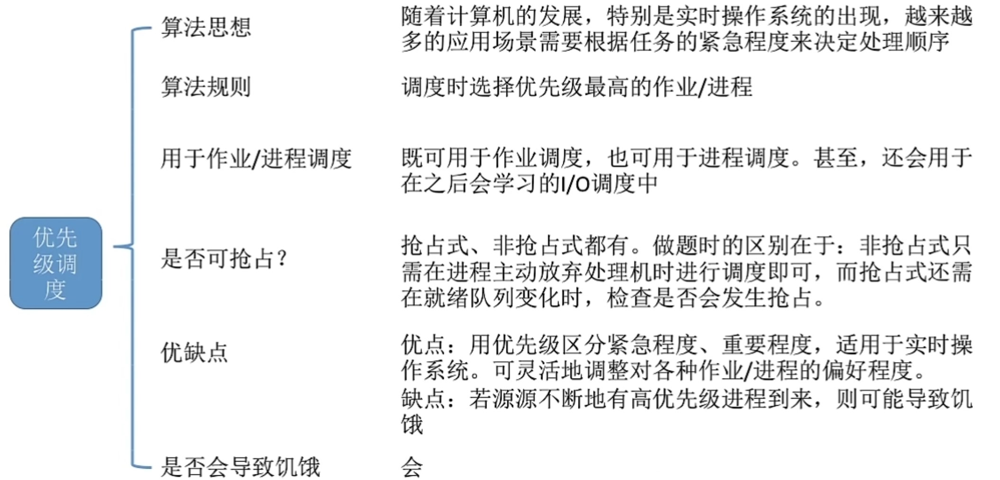
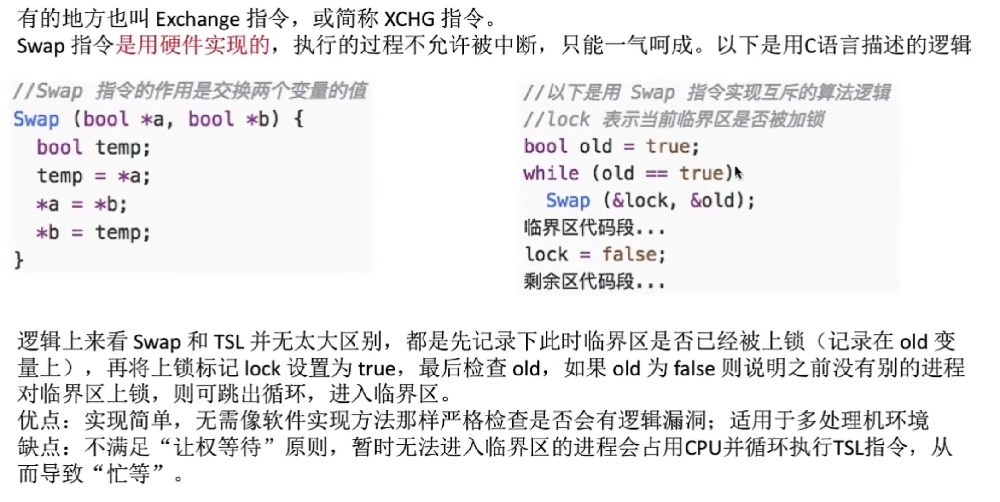
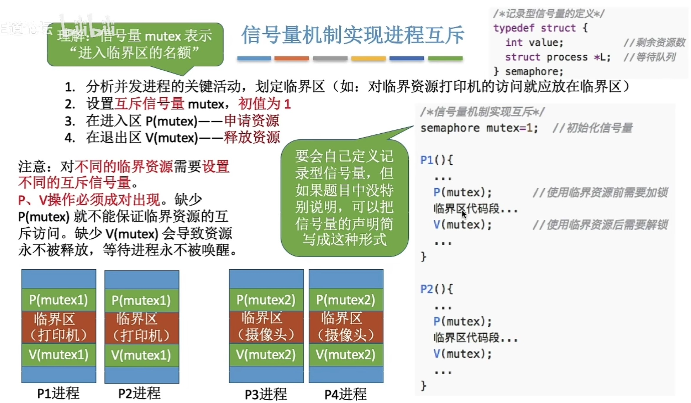

# 操作系统原理

## 一、基础知识

***打开Windows操作系统的“任务管理器”： Ctrl + Alt + Del***

### 1.操作系统的概念

**操作系统**(OS) ：控制和管理整个计算机系统的硬件和软件资源，并合理地组织调度计算机的工作和资源的分配；以提供给用户和其他软件的接口和环境；是计算机系统中最基本的系统软件。

- [ ] **操作系统是系统资源的管理者**

​       作为系统资源的管理者提供的功能：处理机管理  存储器管理  文件管理  设备管理														

- [ ] **向上层提供方便易用的服务**

​       封装思想。提供的服务：1.     **GUI**(图形化用户接口)         

​                                                  2.1.  **联机命令接口** (交互式命令接口)   用户说一个命令，系统跟着做一个

​                                                  2.2.  **脱机命令接口** (批处理命令接口)   用户说一堆命令，系统跟着做一堆

​    											  3.     **程序接口**   在程序中进行系统调用，来使用程序接口（通过程序代码间接使用）


- [ ] **操作系统是最接近硬件的一层软件**

​       

执行一个程序前需要将该程序放到内存中，才能被CPU处理


### 2.操作系统的特征

四大特征：**并发    共享    虚拟    异步**

最基本的特征：**并发和共享** （且二者互为存在条件）

并发性：指计算机系统中同时存在着多个运行着的程序

共享性：指系统中的资源可供内存中多个并发执行的进程共同使用


#### 并发

并发指两个或多个事件在**同一时间间隔内**发生。这些事件宏观上是同时发生的，但微观上是**交替**发生的。

（***并行**：指两个或多个事件在**同一时刻时**发生*）

操作系统和程序并发是一起诞生的。

- [ ] 单核CPU ：同一时刻只能执行**一个**程序，各个程序只能**并发**地执行
- [ ] 多核CPU ：同一时刻同时执行**多个**程序，多个程序可以**并行**地执行

（4核CPU 可以**并行**执行不超过4个程序，超过四个则**并发性**也必不可少）


#### 共享

##### 互斥共享方式

在一个时间段内只允许一个进程访问该资源。  例如：摄像头的使用

##### 同时共享方式

允许一个时间段内由多个进程“同时”对它们进行访问。   例如：多个进程访问硬盘


#### 虚拟

把一个物理上的实体变为若干个逻辑上的对应物。物理实体（前者）时实际存在的，在逻辑上对应物是用户感受到的。

##### 空分复用技术

##### 时分复用技术


#### 异步

**进程的异步性**：在多道程序环境下，允许多个程序并发执行，但由于资源有限，进程不是一贯到底的，而是走走停停，以不可知的速度向前推进。

并发运行的程序会争抢着使用系统资源。


### 3.操作系统的发展与分类

#### 3.1 手工操作阶段

**主要缺点**：用户独占全机、人机速度矛盾 —> 资源利用率极低。


#### 3.2 批处理阶段

##### 单道批处理系统

*操作系统的雏形*

引入脱机输入/输出技术（通过 外围机+磁带 完成），并由监督程序负责控制作业的输入、输出

**优点**：缓解了一定程度的人机速度矛盾，资源利用率有所提升

**缺点**：内存中仅能有一道程序运行，只有该程序运行结束后才能调入下一道程序。**CPU有大量时间是在空闲等待I/O完成**。资源利用率仍然不高。


##### 多道批处理系统

*操作系统正式诞生*

**优点**：多道程序**并发**执行，共享计算机资源。**资源利用率大幅提升**，CPU和其它资源更能保持“忙碌”状态，**系统吞吐量增大**。

**缺点**：**用户响应时间长，没有人机交互功能**。

由左图就可以看出：系统每时每刻都在**输入-计算-输出**


#### 3.3 分时操作系统

计算机以**时间片**为单位轮流为各个用户/作业服务，各个用户可通过终端与计算机进行**交互**。

**优点**：**用户请求可以被即时响应，解决了人机交互问题**。允许多个用户同时使用一台计算机，并且用户对计算机的操作**相互独立**。

**缺点**：**不能优先处理一些紧急事务**。操作系统对于各个用户/作业都是完全公平，循环地为每个用户/作业服务一个时间片，不区分任务的紧急性。


#### 3.4 实时操作系统

**优点**：能够优先响应一些紧急任务，某些紧急任务不需时间片排队。

​            主要特点是**及时性和可靠性**

**分类**：***硬实时系统***——必须在绝对严格的规定时间内完成处理   （如：火箭发射系统）

​		    ***软实时系统***——能接受偶尔违反时间规定  （如：火车订票系统）


#### 3.5 其它类型的操作系统

网络操作系统：实现网络中资源共享 和 各计算机间的通信

分布式操作系统：分布性&并行性

个人计算机操作系统


### 4.操作系统的运行

**操作系统内核**（简称“**内核**”）：由许多内核程序组成，是操作系统最重要最核心的部分，也是最接近硬件的部分

内核(Kernel)：可以令CPU执行**特权指令**


#### 4.1 运行机制

指令就是处理器（CPU）能识别、执行的最基本命令。

##### 两类程序

程序运行的过程就是CPU执行一条一条的机器指令的过程

可分为：**应用程序** 和 **内核程序**

**操作系统内核**（简称“**内核**”）：由许多内核程序组成，是操作系统最重要最核心的部分，也是最接近硬件的部分


##### 两类指令

CPU设计和生产的时候就划分了特权指令和非特权指令，所以CPU执行一条指令前就能判断出其类型

应用程序  **只能**使用”**非特权指令**“

内核程序  **可以**让CPU执行”**特权指令**“


##### 两种处理器状态

CPU有两种状态：

- **内核态**：此时运行的是内核程序，可以执行特权指令
- **用户态**：此时运行的是应用程序，只能执行非特权指令

ps：CPU中有一个寄存器叫程序状态字寄存器（PSW），其中有一个二进制位：1——”内核态“    2——”用户态“

​        **内核态**又称为**核心态**、**管态**  

​        **用户态**又称为**目态**


##### 状态切换

**内核态—>用户态**：执行一条特权指令——修改PSW的标志位为”用户态“。操作系统主动让出CPU使用权。

**用户态—>内核态**：由”中断“引发，硬件自动完成变态过程。

​                                 触发中断信号意味着操作系统将强行夺回CPU使用权。


#### 4.2 中断和异常

”**中断**“是让**操作系统内核夺回CPU使用权**的唯一途径。

**用户态 ——>  内核态**

（*没有中断机制，那么一旦应用程序在CPU上运行就不会停止，也就没有”并发“了*）


##### 中断

***外中断***，与当前执行的指令**无关**，中断信号来源于CPU**外部**

例如：时钟中断；

​            I/O中断；

##### 异常

***内中断***，与当前执行的指令**有关**，中断信号来源于CPU**内部**

例如：**陷阱、陷入**：执行”陷入指令“，是故意引发的；

​            **故障**：缺页故障；

​            **终止**：试图在用户态下执行特权指令；执行除法指令时除数为0；

***应用程序请求操作系统内核服务时，会执行”陷入指令“，该指令会引发一个内部中断信号。***这意味着应用程序主动地将CPU控制权还给操作系统内核。

”**系统调用**“就是用**陷入指令**完成的。


#### 4.3 系统调用

**系统调用是操作系统对应用程序/程序员提供的接口，可以通过系统调用来请求操作系统内核的服务**

##### 实例

Word和WPS同时打印；

由操作系统内核对共享资源同意管理，并向上提供”系统调用“，用户进程想要使用打印机这种共享资源，只能通过系统调用向操作系统内核发出请求。内核会对各个请求进行协调处理。

##### 功能划分

- 设备管理
- 文件管理
- 进程控制
- 进程通信
- 内存管理

##### 过程

1. 传递系统调用参数 
2. 执行陷入指令（用户态），引发内中断，使CPU进入核心态
3.  执行相应的内核程序处理系统调用（核心态）
4.  返回应用程序


### 5.体系结构


#### 分层结构


#### 模块化


#### 宏内核、微内核


**大内核**：优点是 高新能；

​				缺点是 内核代码庞大结构混乱。难以维护

**微内核**：优点是 内核功能少，结构清晰，方便维护

​			    缺点是 需要频繁进行状态转换，性能低


### 6.操作系统引导

**开机过程**


1. CPU从一个特定主存地址开始，取指令，执行ROM中的引导程序（先进行硬件自检，再开机）
2. 将磁盘的第一块 —— 主引导记录 读入内存，执行磁盘引导程序，扫描分区表
3. 从活动分区（又称主分区，即安装了操作系统的分区）读入分区引导记录，执行其中的程序
4. 从根目录下找到完整的操作系统初始化程序（即 启动管理器）并执行，完成“开机”的一系列动作


### 7.虚拟机


对比.bmp)


------


## 二、进程与线程

### 初识进程

#### 概念辨析

**程序**：静态的；是存放在磁盘里的可执行文件，是一系列的指令集和。

**进程**：动态的；是程序的一次执行过程。

***同一个程序多次执行会对应多个进程***


#### 进程的组成：PCB

**PCB**( **进程控制块** )：操作系统需要对各个并发运行的进程进行管理，管理时所需要的信息都会放在**PCB**中。

**PCB是进程存在的唯一标志，当进程被创建时，操作系统会为其创建PCB，当进程结束时，会回收其PCB**


**包括**：

- 进程描述信息
- 进程控制和管理信息
- 资源分配清单
- 处理机相关信息

**例如**：PID(进程ID)，UID(进程所属用户ID)，进程分配到的资源，进程运行情况 ... ...


**进程实体 = PCB + 程序段 + 数据段**

进程是进程实体的**运行过程**，是系统进行资源分配和调度的一个独立单位。


##### 进程的特征

1. 动态性
2. 并发性
3. 独立性
4. 异步性
5. 结构性


### 进程状态

#### 五大状态

##### 创建态

**进程正在被创建**时的状态

在这个阶段操作系统会为进程分配资源、初始化PCB


##### 就绪态

**进程创建完毕后**进入的状态

处于就绪态的进程以及具备运行条件，但由于没有CPU，暂时不能运行


##### 运行态

**进程在CPU上运行时**的状态

CPU会执行该进程对应的程序（执行指令序列）


##### 阻塞态

进程因请求等待某个事件发生（如某种系统资源的分配）而**无法继续执行**，这时操作系统会让这个进程下CPU并让它进入阻塞态

系统资源分配到了则**由阻塞态转换为就绪态**


##### 终止态

**一个程序执行exit系统调用，请求操作系统终止该进程**

操作系统会让该进程下CPU，并回收内存空间等资源，最后回收该进程的PCB


#### 状态转换

##### 经典状态转换流程图


##### 进程状态概述图


### 进程控制

进程控制的主要功能是对系统中的所有进程实施有效的管理，它具有创建新进程、撤销已有进程、实现进程状态转换等功能

**使用原语进行进程控制**

#### 原语

- 原语用**开/关中断**来实现
- 原语是一种**特殊的程序**
- 原语的执行具有**原子性**，即执行过程**不允许被中断**


无论哪个进程控制原语，无非做到三类事情：

1. 更新PCB中信息
2. 将PCB插入合适的队列
3. 分配/回收资源

#### 进程创建


#### 进程终止


#### 进程的阻塞和唤醒


#### 进程的切换


在进程切换时在PCB中保存这个进程的**运行环境**（寄存器信息），当原来的进程再次运行时，可以通过它的PCB恢复它的**运行环境**。


### 进程通信

进程间通信（IPC）指两个进程之间产生**数据交互**。

进程是分配系统资源的单位（包括内存地址空间），因此**各进程拥有的内存地址空间相互独立**。一个进程不能直接访问另一个进程的地址空间。

- 共享存储
- 消息传递
- 管道通信


### 线程


#### 线程的实现方式

##### 用户级线程


##### 内核级线程


#### 多线程模型（内核级）

##### 一对一模型


##### 多对一模型


##### 多对多模型


------


## 三、进程调度算法

### 调度的基本概念

当有一堆任务要处理，但由于资源有限，这些事情没法同时处理，这就需要确定**某种规则**来决定这些任务的**处理顺序**。

#### 三大层次


##### 高级调度（作业调度）

按一定的原则从外存的作业**后备队列**中挑选一个作业调入内存，并创建进程。

每个作业只**调入一次，调出一次**；

作业调入时会建立PCB，调出时才撤销PCB。


##### 中级调度（内存调度）

按照某种策略决定将哪个在**挂起队列**中的进程重新调入内存。

注：内存不够时，可**将某些进程的数据调出外存**。等内存空闲或者进程需要运行时再重新调入内存。

​        暂时调到外存等待的进程状态为**挂起状态**。被挂起的进程PCB会被组织成**挂起队列**。

内存调度频率高于作业调度：一个进程可能被多次调出、调入内存


##### 低级调度（进程调度）

按照某种策略从**就绪队列**中选取一个进程，将处理机分配给它。

进程调度的**频率很高**，一般几十毫秒一次。


#### 七状态模型


**挂起**：进程映像在外存

**阻塞**：进程映像在内存


### 进程调度详解

#### 进程调度的时机

**进程调度**（低级调度），就是按照某种算法从就绪队列中选择一个进程为其分配处理机。

进程在**操作系统内核程序临界区**中**不能**进行调度与切换。


##### 需要进程调度的情况


##### 不能进程调度的情况


#### 进程调度的方式

##### 非抢占式

只允许进程主动放弃处理机。在运行过程中即使有更紧迫的进程到达，也必须等当前**进程终止**或**主动要求进入阻塞态**。

优点：实现简单，系统开销小。

缺点：无法处理紧急任务。适合于早期的批处理系统。


##### 抢占式

可以立即暂停正在执行的进程，将处理机分配给更重要紧迫的进程。（每个**时钟中断**或k个时钟中断触发调度）

优点：可以优先处理更紧急的进程，也可以实现按时间片轮流执行的功能。适合于分时操作系统、实时操作系统。


#### 进程的切换与过程

**进程切换**：一个进程让出处理机，由另一个进程占用处理机的过程。

**狭义的进程调度**：从 就绪队列 中选择一个要运行的进程。

**广义的进程调度**包括了**进程切换**和**狭义的进程调度**。


触发调度程序：

- **创建新进程**
- **进程退出**
- **运行进程阻塞**
- **I/O中断发生**（可能唤醒某些阻塞进程）


#### 闲逛进程

没有其他就绪进程时，运行闲逛进程。

特性：

- 优先级最低
- 可以是0地址指令，占一个完整的指令周期（指令周期末尾例行检查中断）
- 能耗低


### 进程调度算法

#### 调度算法的评价指标


##### CPU利用率

$$
利用率=忙碌时间/总时间
$$

##### 系统吞吐量

$$
系统吞吐量=完成作业量/总时间
$$

##### 周转时间

$$
周转时间=作业完成时间-作业提交时间\\
平均周转时间=作业周转时间之和/总作业数\\

 \\带权周转时间=作业周转时间/作业运行时间\\
平均带权周转时间=作业带权周转时间之和/总作业数
$$

***高级调度时间**+**低级调度时间**+**进程在CPU上执行时间**+**进程等待I/O操作完成的时间***

*带权周转时间越小，用户满意度越高*


##### 等待时间

*指进程/作业**处于等待处理机状态时间之和**。*


##### 响应时间

***从用户提交请求到首次产生响应所用的时间***
$$
响应时间=首次响应时间-提交请求时间
$$


#### 调度算法

##### 先来先服务(FCFS)


##### 最短作业优先(SJF)  和  最短进程优先(SPF)


###### 非抢占式


###### 抢占式


##### 最高响应比优先(HRRN)


##### 时间片轮转


**不同时间片**


**总结**


##### 优先级调度



优先级可分为：**静态优先级**

​                           **动态优先级**

通常：**系统进程** 优先级高于 **用户进程**

​	       **前台进程** 优先级高于 **后台进程**

​	   	**操作系统更偏好I/O进程**（I/O设备和CPU可以并行工作，优先让I/O繁忙型进程优先运行，会使资源利用率和系统吞吐量都得到提升）


###### 抢占式


###### 非抢占式


##### 多级反馈队列


**多级队列调度算法**


**这三种算法：【时间片轮转】、【优先级调度】、【多级反馈队列】，适合用于交互式系统。**


------


## 四、同步与互斥

### 进程同步

进程具有**异步性**的特征。（异步性：各并发执行的进程以各自独立的、不可预知的速度向前推进）

**进程同步**指为了完成某种任务而建立的两个或多个进程，这些进程需要在某些位置上**协调**它们的**工作次序**而产生的制约关系。进程间的**直接制约关系**源于他们之间的互相合作。


### 进程互斥

**临界资源**：一个时间段内只允许一个进程使用的资源。（例如：许多物理设备——打印机、摄像头等；内存缓冲区等也属于临界资源）

对于临界资源的访问，必须互斥地进行。

**进程互斥**：互斥是**间接制约关系**。进程互斥指当一个进程访问某临界资源时，另一个想要访问该临界资源的进程必须等待，直到当前进程访问结束、释放该资源后，另一个进程才能访问。


#### 进程互斥遵循原则

##### 1. 空闲让进

临界区空闲，可以允许一个请求进入临界区的进程立即进入临界区。

##### 2. 忙则等待

当已有进程进入临界区时，其它试图进入临界区的进程必须等待。

##### 3. 有限等待

对请求访问的进程，应保证其能在有限时间内进入临界区（保证不会饥饿）。

##### 4. 让权等待

当进程不能进入临界区时，应立即释放处理机，防止进程**忙等待**。


#### 进程互斥的软件实现方法

##### 单标志法

```C
int turn = 0;//标志turn 表示当前允许进入临界区的进程号
//P0进程:
while(turn != 0); //进入区 直到turn=0退出循环，从进入区到临界区
critical section; //临界区 占用临界资源
turn = 1;         //退出区 令turn=1,使P1进程得到进入临界区的资格
remainder section;//剩余区 

//P1进程:
while(turn != 1); //进入区
critical section; //临界区
turn = 0;         //退出区
remainder section;//剩余区 
```

该算法实现了“**同一时刻最多只允许一个进程访问临界资源**”

###### 问题分析

但是，只能P0—>P1—>P0—>P1—>P0—>......这样轮流访问，当某时刻允许进入的进程P0**一直不访问临界区**，则虽然临界区空闲，P1仍**不被允许访问**。这种情况违背了“**空闲让进**”。

**单标志法违背了“空闲让进”原则**


##### 双标志先检查法

```C
//算法思想：设置一个布尔型数组flag[],数组中各个元素标记各进程想进入临界区的意愿
//例如：flag[0]=true 表示进程P0想要进入临界区
//进程进入临界区前：先检索当前有没有别的进程想要进入临界区 -> "没有" -> 把自身flag[i]设置为true ->访问
bool flag[2];
flag[0] = false;
flag[1] = false;
//P0进程                     //P1进程
while(flag[1]);   			while(flag[0]);     //如果一个进程想进入临界区，则另一个循环等待
flag[0] = true;   			flag[1] = true;     //标记进程想要进入临界区true
critical section; 			critical section;   //访问临界区
flah[0] = false;  			flah[1] = false;    //访问完成，标记为不想进入临界区false
remainder section;			remainder section;  // 
```

###### 问题分析

如果P0进程在检测到flag[1]=false后进入临界区，但是**还没有将flag[0]设置为true**，而P1进程此刻并不知道P0想要进入临界区，也跳出了循环；两个进程就**都进入了临界区**

**双标志先检查法违背了“忙则等待”原则**


##### 双标志后检查法

```C
//P0进程                     //P1进程
flag[0] = true;   			flag[1] = true;     //先标记
while(flag[1]);   			while(flag[0]);     //再检查
critical section; 			critical section;   //访问临界区
flah[0] = false;  			flah[1] = false;    //访问完成
remainder section;			remainder section;  // 
```

###### 问题分析

要是两个进程都先进行了标记，即flag[0]=true、flag[1]=true，则P0和P1都循环等待，无法进入临界区

**双标志先检查法违背了“空闲让进”和“有限等待”原则**


##### Peterson算法

```c
//算法思想：结合了双标志法和单标志法
bool flag[2];
int turn = 0;

//P0进程                     //P1进程
flag[0] = true;   			flag[1] = true;     	//主动争取，表示自身想进入临界区
turn = 1;        			trun = 0;           	//主动谦让，优先让对方进入临界区
while(flag[1]&&turn==1);    while(flag[0]&&turn==0);//自身想进 或是 对方想进，则继续循环等待
critical section; 			critical section;   	//访问临界区
flah[0] = false;  			flah[1] = false;    	//访问完成，表示自身不想进临界区了
remainder section;			remainder section;  	// 
```

###### 分析

Peterson算法解决了进程互斥问题，遵循了“**空闲让进**”、“**忙则等待**”、“**有限等待**”三个原则，但是依然未遵循“**忙则等待**”原则


#### 进程互斥的硬件实现方法

##### 中断屏蔽方法


##### TestAndSet指令


##### Swap指令




#### 互斥锁

##### 介绍


##### 特性


### 信号量机制


#### 类型

##### 整型信号量


##### 记录型信号量


这里面的 **L** 为**等待队列**，是全局生效的

原语block(S.L)    会使进程从运行态进入阻塞态，挂起到信号量S的等待队列（阻塞队列）中

原语wakeup(S.L)会唤醒等待队列中的一个进程（阻塞态—>就绪态）


#### 应用

##### 实现进程互斥




##### 实现进程同步


##### 实现前驱关系


**总结**：

**互斥问题**：信号量初始值设置为 **1**

**同步问题**：信号量初始值设置为 **0**

**前驱关系**：本质上就是多级同步问题


### 同步与互斥问题

#### 生产者-消费者问题

##### 问题描述


##### 如何解决？

```c
semaphore mutex = 1;//互斥信号量，实现对缓冲区的互斥访问
semaphore empty = n;//同步信号量，表示空闲缓冲区的数量
semaphore full = 0; //同步信号量，表示产品的数量，即非空缓冲区的数量

producer(){
    while(true){
        生产一个产品;
        P(empty);            //消耗一个空闲缓冲区
        P(mutex);
        把产品放入空闲缓冲区;
        V(mutex);
        V(full);             //增加了一个产品，非空缓冲区+1
    }
}

comsumer(){
    while(true){
        P(full);             //取出了一个产品，非空缓冲区-1
        P(mutex);
        从缓冲区中取出产品;
        V(mutex);
        V(empty);            //增加一个空闲缓冲区
        使用产品;
    }
}

//如果两个进程producer & comsumer先对互斥信号量mutex进行P操作,
//当empty=0 full=n时,会导致两者都被阻塞，发生死锁。
```


#### 多生产者-多消费者问题

##### 问题描述


##### 如何解决？

略。


#### 吸烟者问题

##### 问题描述


##### 如何解决？

```c
//缓冲区大小为1，四个同步信号量中至多有一个值为1
semaphore offer1 = 0;     //桌上组合一的数量
semaphore offer2 = 0;     //桌上组合二的数量
semaphore offer3 = 0;     //桌上组合三的数量
semaphore finish = 0;     //抽烟是否完成

int i = 0;                //用于实现“三个抽烟者轮流抽烟”

provider(){
    while(1){
        if(i==0){
            将组合一放在桌上;
            V(offer1);
        }else if(i==1){
            将组合二放在桌上;
            V(offer2);
        }else if(i==2){
            将组合三放在桌上;
            V(offer3);
        }
        i = (i+1)%3;
        P(finish);
    }
}

smoker1(){
    while(true){
        P(offer1);
        从桌上拿走组合一，卷烟，抽掉;
        V(finish);
    }
}
smoker2(){
    while(true){
        P(offer2);
        从桌上拿走组合二，卷烟，抽掉;
        V(finish);
    }
}
smoker3(){
    while(true){
        P(offer3);
        从桌上拿走组合三，卷烟，抽掉;
        V(finish);
    }
}
```


#### 读者写者问题

##### 问题描述


##### 如何解决？

**第一种方法“读优先”**

```c
semaphore rw = 1;     //用于记录对共享文件的互斥访问
int count = 0;        //记录当前有几个读进程在访问文件

writer(){
    while(true){
        P(rw);        //“写”开始前，加锁
        写文件;
        V(rw);        //“写”完毕后，解锁
    }
}

reader(){//允许多个读者进程并发执行
    while(true){
        //当第一个读进程开始时(count==0)，对rw进程P操作——上锁，这样写进程就进不来了
        if(count==0)  
            P(rw);    //“读”开始前，解锁
        count++;      //访问文件的读进程+1
        
        读文件;
        
        count--;      //访问文件的读进程-1
        //最后一个读进程结束(count==0)，释放rw，这样就解锁了，允许写进程执行进入
        if(count==0)  
            V(rw);    //“读”完毕后，解锁
    }
}

//这段代码的潜在问题是：只要有读进程运行，写进程就要一直阻塞等待，可能导致“饿死”
//也就是 “读优先”
```

**另一种方法“写优先”**

```c
semaphore rw = 1;    //用于实现对共享文件的互斥访问
int count = 0;       //记录当前有几个读进程在访问文件
sumaohore mutex = 1; //用于保证对count变量的互斥访问
semaphore w = 1;     //用于实现“写优先”

writer(){
    while(true){
        P(w);
    P(rw);
    写文件;
    V(rw);
    V(w);
    }
}

reader(){
    while(true){
        P(w);
        P(mutex);
    	if(count==0)
        	P(rw);
    	count++;
    	P(mutex);
    	P(w);
    
    	读文件;
    
    	P(mutex)
   		count--;
    	if(count==0)
        	V(rw);
    	V(mutex);
    }
}
//并不是真正的写优先，而是相对公平的“先到先服务FCFS”
```


#### 哲学家就餐问题

##### 问题描述


当5名哲学家并发地拿起了自己左手边的筷子，那么，每位哲学家都要 **循环等待** 右边的人放下筷子（阻塞），发生死锁。

##### 如何防止死锁？

对哲学家进程施加限制条件

- 最多允许四个哲学家同时进餐。可以保证至少有一个哲学家可以拿到左右两只筷子。
- 要求奇数号哲学家先拿左边筷子，偶数号哲学家先拿右边筷子。使相邻的两个奇偶号哲学家先共同争用一支筷子，一个拿起、另一个阻塞。
- 仅当一个哲学家左右两支筷子都可用时才允许他抓起筷子。
- 


### 管程

***信号量机制存在的问题：编写程序困难、易出错***

“**管程**”——**一种高级的同步机制**  应运而生


#### 组成

管程是一种特殊的软件模块，由这些部分组成：

1. 局部于管程的共享数据结构的说明；
2. 对该数据结构进行操作的一组过程；
3. 对局部于管程的共享数据设置初始值的语句；
4. 管程的名字。


#### 基本特征

1. 局部于管程的数据只能被局部于管程的过程所访问；
2. 一个进程只有通过调用管程内的过程才能进入管程访问共享数据；
3. 每次仅允许一个进程在管程内执行某个内部进程。


#### 管程解决生产者消费者问题


#### JAVA：synchronized


------


## 五、死锁

**死锁**：在并发环境下，各进程因竞争资源而造成的一种 **互相等待对方手里的资源**，导致**各进程都阻塞**，都无法向前推进 的现象。

**饥饿**：由于长期得不到想要的资源，某进程无法向前推进的现象。如：短进程优先算法SPF

**死循环**：某进程执行过程中一直跳不出某个循环的现象。


### 死锁产生的必要条件

死锁的产生**必须满足四个必要条件**，只要其中一个或者几个条件不满足，死锁就不会发生。

#### 四个必要条件

**互斥条件**：只有对必须互斥使用的资源的争抢才会导致死锁。

**不剥夺条件**：进程所获得的资源在未使用完之前，不能由其它进程强行夺走，只能主动释放。

**请求和保持条件**：进程以及保持了至少一个资源，但又提出了新的资源请求，而该资源又被其它进程占有，此时请求进程被阻塞，但又对自己已有的资源保持不放。

**循环等待条件**：存在一种进程资源的循环等待链，链中的每一个进程已获得的资源同时被下一个进程所请求。


**发生死锁时一定由循环等待，但是发生循环时未必死锁  **  ——    **循环等待是死锁的必要不充分条件**


#### 什么时候会发生死锁

##### 破坏互斥条件


##### 破坏不剥夺条件


##### 破坏请求和保持条件


##### 破坏循环等待条件


***总结***：


### 死锁的处理策略

#### 预防死锁（静态策略）

##### 破坏互斥条件


##### 破坏不剥夺条件


##### 破坏请求和保持条件


##### 破坏循环等待条件


#### 避免死锁（动态策略）

##### 安全序列

*案例：*


##### 银行家算法

案例：


具体实现：


**实例**：

**系统处于安全状态（能找到安全序列）：**


**系统处于不安全状态（不能）：**


#### 死锁的检测和解除

##### 死锁的检测


##### 死锁的解除


## 六、内存

### 内存基础

#### 内存定义及其作用

内存可以存放数据。程序执行前**需要先放到内存中才能被CPU处理**——缓和CPU于硬盘之间的速度矛盾。


#### 进程运行的基本原理

逻辑地址（相对地址）  **VS**  物理地址（绝对地址）


从写程序到程序运行：

1. **编辑源代码文件**
2. **编译**：由源代码文件生成目标模块（高级语言“翻译”为机器语言）
3. **链接**：有目标模块生成装入模块，链接后形成完整的逻辑地址
4. **装入**：将装入模块装入内存，装入后形成物理地址


##### 三种链接方式


##### 三种装入方式


### 内存管理

具体的内存管理内容：

- 操作系统负责**内存空间的分配与回收**


- 操作系统需要提供某种技术从逻辑上**对内存空间进行扩充**


- 操作系统需要提供**地址转换**功能，负责程序的**逻辑地址**与**物理地址**

1. 绝对装入：            编译器负责地址转换      （单道程序阶段，无操作系统）
2. 可重定位装入：    装入程序负责地址转换   （早期多道批处理阶段）
3. 动态运行时装入：运行时才进行地址转换   （现代操作系统）


- 操作系统需要实现**内存保护**功能，保证各进程在自己的内存空间内运行，不会越界访问

1. 设置上下限寄存器
2. 利用重定位寄存器、界地址寄存器进行判断


### 内存空间的分配与回收

#### 连续分配管理方式

##### 单一连续分配


##### 固定分区分配


##### 动态分区分配


#### 动态分区分配算法

##### 首次适应算法


##### 最佳适应算法


##### 最坏适应算法


##### 邻近适应算法


**总结**：


### 内存空间的扩充

#### 覆盖技术


#### 交换技术


#### 虚拟存储技术


### 基本分页存储管理


### 地址变换机构

#### 基本地址管理机构


#### 具有快表的地址变换机构


### 两级页表


### 管理方式

#### 基本分段存储管理方式


#### 段页式管理方式


### 虚拟内存


### 请求分页管理方式


### 页面置换算法


### 页面分配策略、抖动、工作集


### 内存映射文件


## 七、文件管理


### 文件目录


### 文件结构

#### 文件的逻辑结构


#### 文件的物理结构


### 文件存储空间管理


### 文件的基本操作


### 文件共享


### 文件保护


### 文件系统的结构

#### 文件系统的层次结构


#### 文件系统的全局结构


### 虚拟文件系统


## 八、I/O

### I/O控制器


### I/O控制方式


### I/O软件层次结构


### 输入输出应用程序接口和驱动程序接口


### I/O核心子系统


### 假脱机技术


### 设备的分配与回收


### 缓冲区管理


### 磁盘

#### 磁盘结构


#### 磁盘调度算法


#### 减少磁盘延迟时间的方法


#### 磁盘管理


   
